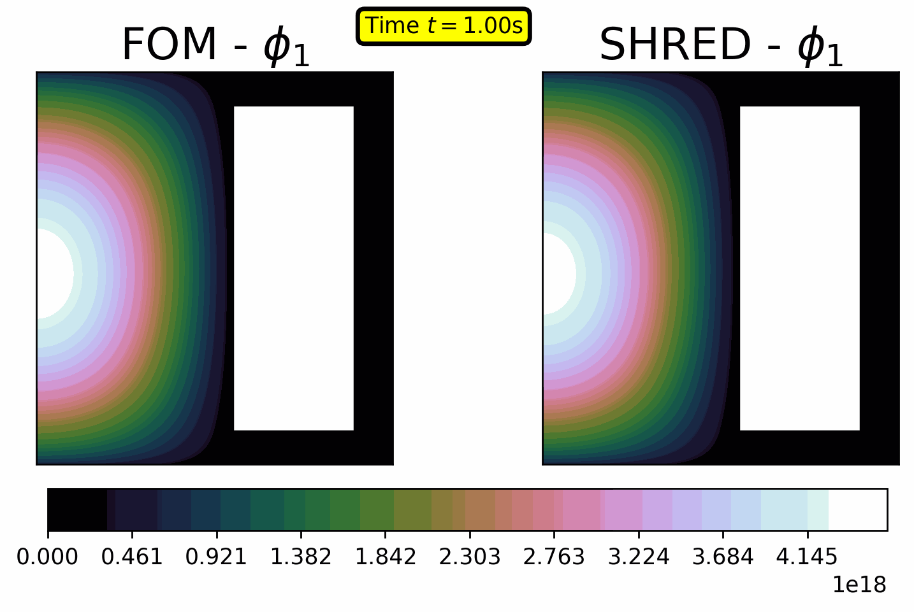
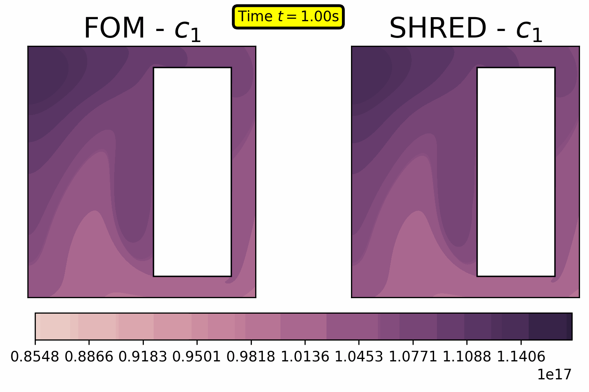
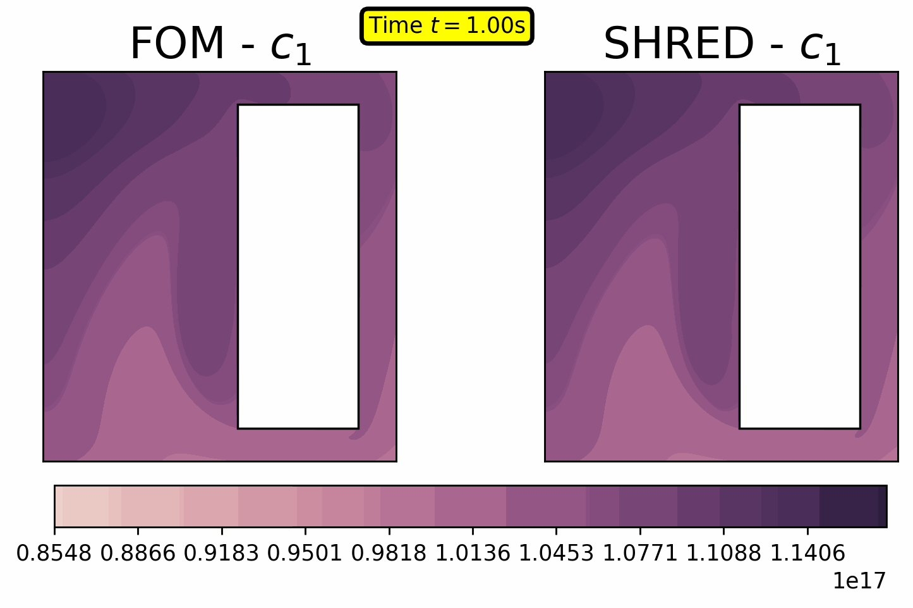
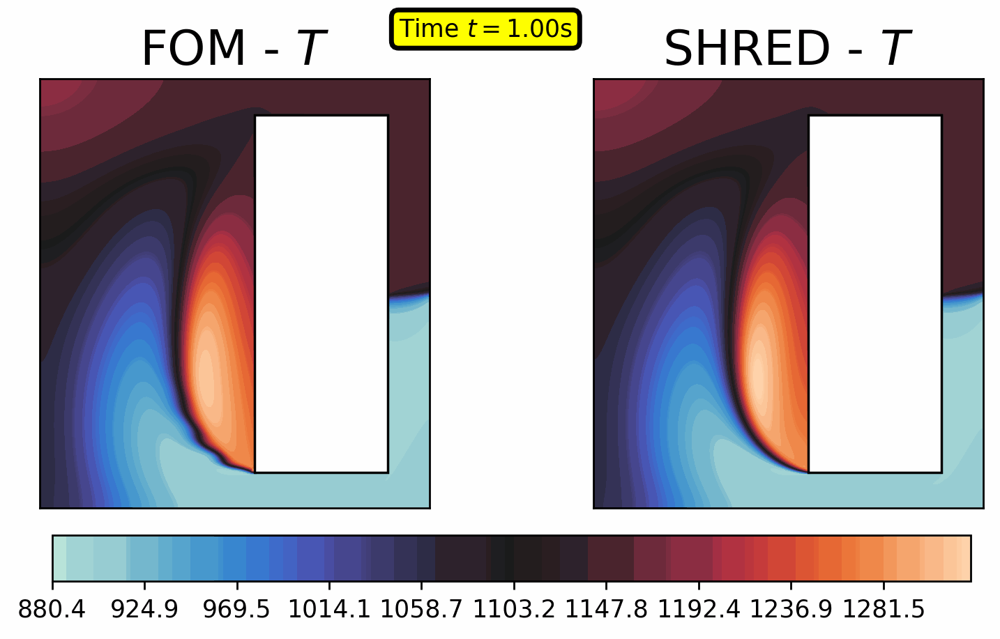

# P2: Towards Efficient Parametric State Estimation in Circulating Fuel Reactors with Shallow Recurrent Decoder Networks

This folder collects the supporting notebooks of the following paper:

- S. Riva, C. Introini, J. N. Kutz and A. Cammi, “Towards Efficient State Estimation in
Circulating Fuel Reactors with Shallow Recurrent Decoder Networks,” 2025. preprint available at
[https://arxiv.org/abs/2503.08904](arxiv.org/abs/2503.08904).

On [Zenodo](https://zenodo.org/records/15015236), the simulation data (compressed) are available.

In case interested to the raw data, please contact antonio.cammi@polimi.it.

- `01_svd.ipynb` is a preliminary analysis of the dataset through the Singular Value Decomposition.
- `02_shred_outcore.ipynb` is the key file supporting the paper, in which the SHRED method is applied to the parametric MSFR-ULOFF dataset (D2) adopting out-core fast flux sensor measurements.
- `03_sensitivity_ensemblesize.ipynb` is a sensitivity analysis of the ensemble size on the SHRED models.
- `04a_shred_mobile_sensors.ipynb` is the notebook supporting the paper, in which the SHRED method is applied to the parametric MSFR-ULOFF dataset (D2) adopting mobile sensors for the first group of precursors.
- `04b_shred_mobile_probes.ipynb` is the notebook supporting the paper, in which the SHRED method is applied to the parametric MSFR-ULOFF dataset (D2) adopting mobile probes measuring only the position.
- `05_comparison_shred_online.ipynb` is a comparison between the different sensing strategies, i.e., out-core sensors, mobile sensors, and mobile probes.

Gifs can be found in the [`media` folder](https://github.com/ERMETE-Lab/NuSHRED/tree/main/media/P2):

### Fast Flux $\phi_1$

| Outcore | Mobile Sensor | Mobile Probe |
|---------|---------------|--------------|
|  |  |  |

### First Group of Precursors $c_1$
| Outcore | Mobile Sensor | Mobile Probe |
|---------|---------------|--------------|
|  |  |  |

# Temperature $T$
| Outcore | Mobile Sensor | Mobile Probe |
|---------|---------------|--------------|
|  |  |  |

# Velocity $\mathbf{u}$
| Outcore | Mobile Sensor | Mobile Probe |
|---------|---------------|--------------|
|  |  |  |
