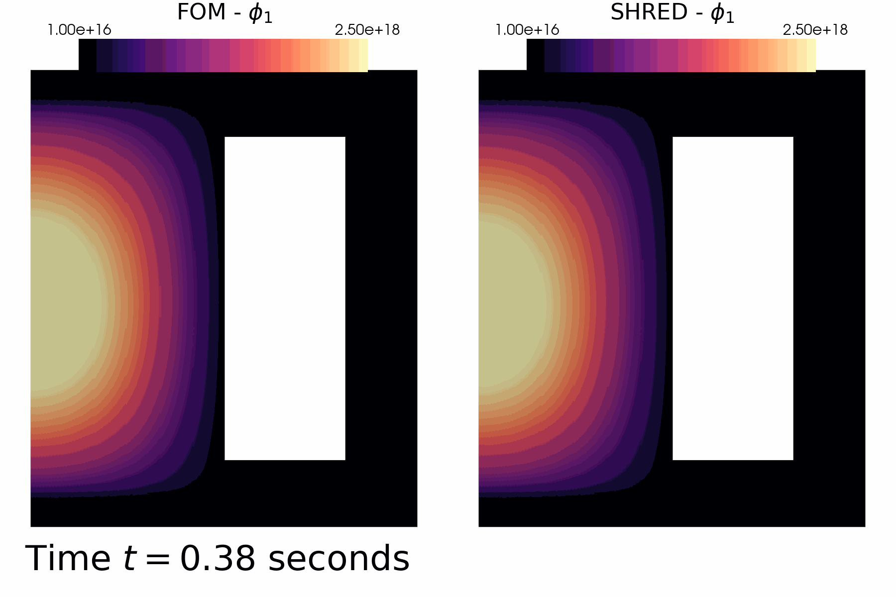
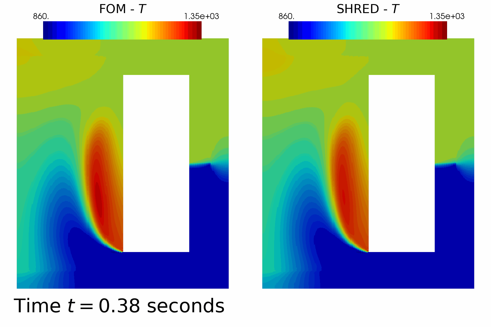
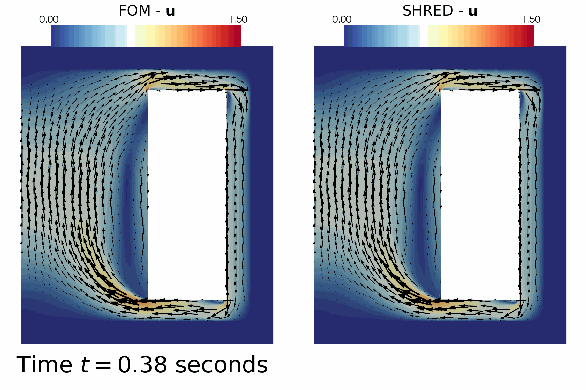
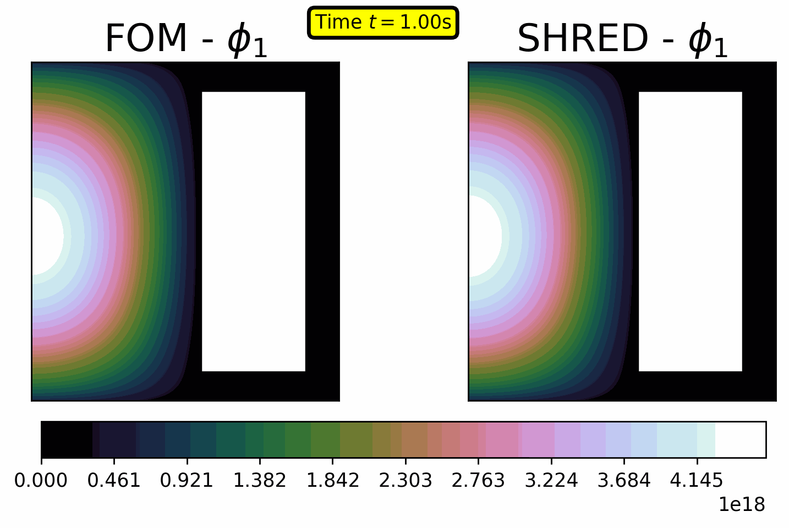
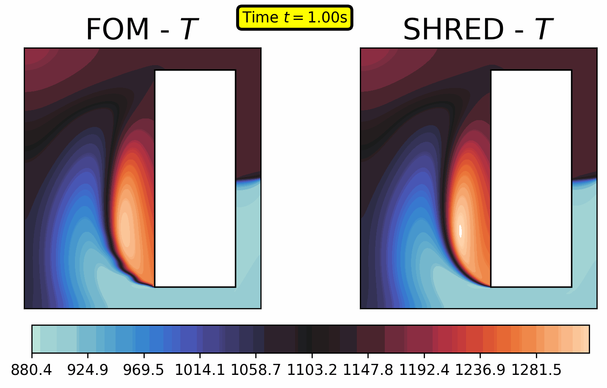
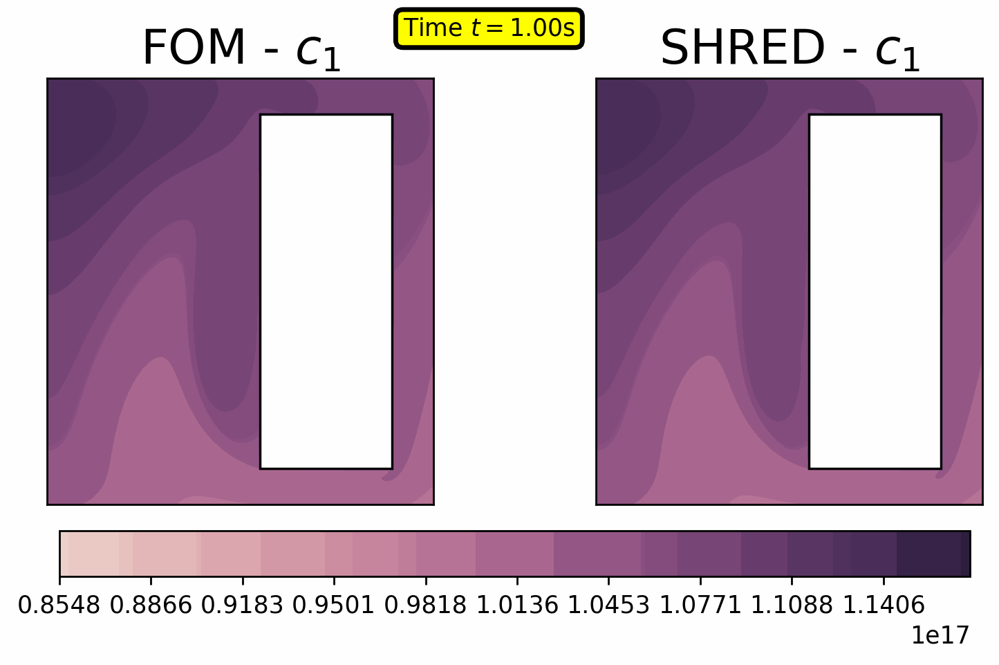
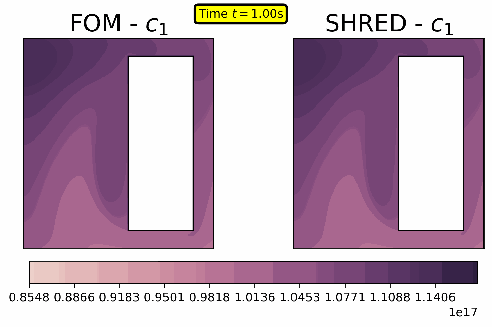
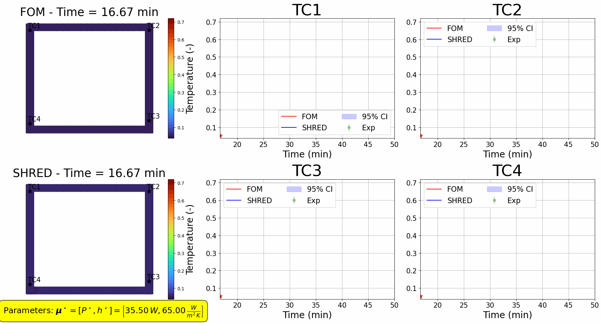
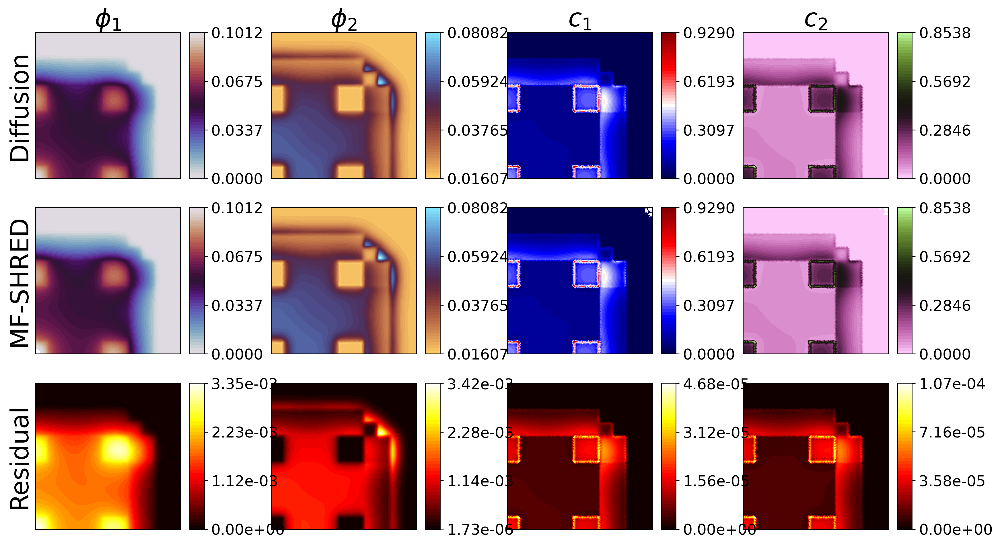

# Shallow Recurrent Decoder for Nuclear Reactors Applications (NuSHRED)

[](LICENSE)
[](https://www.python.org/)
[](https://doi.org/10.5281/zenodo.13789584)
[](https://www.youtube.com/watch?v=AUuGhojLiFk)

This repository collects the codes regarding the application of the **Shallow REcurrent Decoder** (SHRED) method to **Nuclear Reactors** systems 🏭⚛️

---

## 📄 Related Publications

This repository serves as complementary code to the following papers:

- **[P1]** Riva, S., Introini, C., Cammi, A., & Kutz, J. N. (2025). Robust State Estimation from Partial Out-Core Measurements with Shallow Recurrent Decoder for Nuclear Reactors. *Progress in Nuclear Energy*, vol. 189, pp. 105928  [](https://doi.org/10.1016/j.pnucene.2025.105928)

- **[P2]** Riva, S., Introini, C., Kutz, J. N. & Cammi, A. (2025). Towards Efficient Parametric State Estimation in Circulating Fuel Reactors with Shallow Recurrent Decoder Networks [](http://arxiv.org/abs/2503.08904)

- **[P3]** Riva, S., Missaglia A., Introini, C., Kutz, J. N. & Cammi, A. (2026). From Models To Experiments: Shallow Recurrent Decoder Networks on the DYNASTY Experimental Facility [](https://arxiv.org/abs/2503.08907)

- **[P4]** Riva, S., Introini, C., Cammi, A., & Kutz, J. N. (2025). Constrained Sensing and Reliable State Estimation with Shallow Recurrent Decoders on a TRIGA Mark II Reactor. [](https://arxiv.org/abs/2510.12368)

- **[P5]** Riva, S., Introini, C., Kutz, J. N. & Cammi, A., (2026). Multi-Fidelity Learning with Shallow Recurrent Decoders for Multi-Physics Applications. [](https://arxiv.org/abs/2606.05202)

**Upcoming works**: two preprints on arxiv have been submitted on the application of SHRED to Fusion MHD systems (code will be released soon).

---

## 📊 Simulation Data
The compressed simulation datasets are available on **Zenodo**:

[](https://doi.org/10.5281/zenodo.13789584)

- **[MSFR]** Molten Salt Fast Reactor (MSFR) in the accidental scenario *Unprotected Loss Of Fuel Flow (ULOFF)* - Parametric Transients (includes the single-transient reconstruction case used by P1)
- **[DYNASTY]** DYNASTY Experimental Facility - Single Transient (Reconstruction & Prediction mode) and Parametric Transients
- **[TRIGA]** CFD model of TRIGA Mark II Reactor - Single Transient (Reconstruction mode)
- **[LRA-neutronics]** Neutronics Model using Diffusion and Point Kinetics LRA benchmark reactor
- **[RDA]** Non-Linear Reaction-Diffusion-Advection of multiple species (High-Fidelity PDE and Low-Fidelity ODE model)

🎥 If you want to know more about the SHRED method for nuclear reactors, check out this [**YouTube video**](https://www.youtube.com/watch?v=AUuGhojLiFk)!

You can use the script `Code/download_datasets.py` to download the datasets (if `files` argument is not specified, all datasets will be downloaded):

```bash
uv run python Code/download_datasets.py --files MSFR DYNASTY
```

See [Code/README.md](Code/README.md) for download options and dataset preparation.

To cite the repository or datasets, see [`CITATION.cff`](CITATION.cff) (concept DOI: [10.5281/zenodo.13789584](https://doi.org/10.5281/zenodo.13789584)).

---

## 🏗️ Foundations of SHRED

The SHRED method was first proposed and developed in this paper:

- **J. Williams, O. Zahn and J. N. Kutz**, *Sensing with shallow recurrent decoder networks*, [Proc. R. Soc. A, 2024](https://royalsocietypublishing.org/rspa/article/480/2298/20240054/66770/Sensing-with-shallow-recurrent-decoder)

📌 The original code base is available here: [**github.com/Jan-Williams/pyshred**](https://github.com/Jan-Williams/pyshred).

This repository also builds upon a related implementation:

- **Matteo Tomasetto, Jan P. Williams, Francesco Braghin, Andrea Manzoni, J. Nathan Kutz**, *Reduced Order Modeling with Shallow Recurrent Decoder Networks*, [Nature Communications, 2025](https://www.nature.com/articles/s41467-025-65126-y)

📌 Improvements for parametric datasets are available here (collaborative between Matteo Tomasetto and Stefano Riva): [**github.com/MatteoTomasetto/SHRED-ROM**](https://github.com/MatteoTomasetto/SHRED-ROM)

Additionally, the [*pyforce* package](https://github.com/ERMETE-Lab/ROSE-pyforce) is used for **sensor placements** and **EIM/GEIM comparison** in P1. See:
- [Riva et al. (2024)](https://doi.org/10.1016/j.apm.2024.06.040)
- [Cammi et al. (2024)](https://doi.org/10.1016/j.nucengdes.2024.113105)

---

## 📂 Repository Structure

📁 **shred/** → Modules for the implementation of the SHRED network from [**github.com/Jan-Williams/pyshred**](https://github.com/Jan-Williams/pyshred) and [**github.com/MatteoTomasetto/SHRED-ROM**](https://github.com/MatteoTomasetto/SHRED-ROM)

📁 **Code/** → Subfolders `P1`–`P5` with notebooks and paper-specific utilities. See [Code/README.md](Code/README.md); each paper folder has its own README (`Code/P1/README.md`, …). Datasets associated as follows:

|        | MSFR  | DYNASTY | TRIGA | LRA-neutronics |  RDA  |
| ------ | :---: | :-----: | :---: | :------------: | :---: |
| **P1** |   ✅   |         |       |                |       |
| **P2** |   ✅   |         |       |                |       |
| **P3** |       |    ✅    |       |                |       |
| **P4** |       |         |   ✅   |                |       |
| **P5** |   ✅   |         |       |       ✅        |   ✅   |

## ▶️ How to Execute

1️⃣ **Clone or download** the repository.

2️⃣ **Download the datasets** with `Code/download_datasets.py` (extracted by default to `NuSHRED_Datasets/` at the repo root). Optionally copy [`.env.example`](.env.example) to `.env` and set `NUSHRED_DATA_DIR` if you store data elsewhere.

3️⃣ **Install the required dependencies**, using [uv](https://docs.astral.sh/uv/):

   **Base install** (covers P2, P3, P4 and the Tutorials):
   ```bash
   uv sync
   ```

   **P1** additionally requires [`pyforce`](https://github.com/ERMETE-Lab/ROSE-pyforce) (v1.0.0, installed directly from GitHub — it is not published on PyPI) for the sensor-placement (EIM/GEIM) notebooks:
   ```bash
   uv sync --extra p1
   ```

   **Conda / pip alternative:** if you already use a conda environment, an editable install is equivalent:
   ```bash
   python -m pip install -e .          # base (P2–P5)
   python -m pip install -e ".[p1]"  # + pyforce for P1 EIM/GEIM
   ```
   If you manage PyTorch via conda (e.g. for CUDA), install it first, then use `pip install -e . --no-deps` and add the remaining dependencies manually to avoid conflicts.

   **P5** additionally requires FEniCSx (dolfinx v0.10.0) and its dependencies (`gmsh`, `mpi4py`, `petsc4py`, `ufl`, `basix`, `pyvista`) *only if you want to regenerate the raw data yourself* — dolfinx isn't available on PyPI, so it must be installed via a separate conda environment:
   ```bash
   conda create -n dolf python=3.10
   conda activate dolf
   conda install -c conda-forge fenics-dolfinx=0.10.0 gmsh mpi4py pyvista
   ```
   If you use the pre-generated data from Zenodo instead, dolfinx is **not** needed. See the [P5 README](Code/P5/README.md) for further details.

4️⃣ **Open the notebooks** in the relevant `Code/P*/` folder. Each paper directory has its own README with the recommended execution order.

Two simple tutorials are available in the `Tutorial/` folder for Kolmogorov 2D Flow (single- and multi-parametric datasets).

---

## 📬 Contact Information

For inquiries, please contact:
📧 stefano.riva@autodesk.com, carolina.introini@polimi.it, antonio.cammi@polimi.it, nathan.kutz@autodesk.com.

For **issues** or **bugs**, refer to the **GitHub Issues** section of this repository.

---

## 📊 Results

### 📌 Paper 1

| Fast Flux $\phi_1$                         | Temperature $T$                        | Velocity $\mathbf{u}$                  |
| ------------------------------------------ | -------------------------------------- | -------------------------------------- |
|  |  |  |

### 📌 Paper 2

**Out-Core Sensing (Fast Flux)**

| Fast Flux $\phi_1$                         | Temperature $T$                        | Velocity $\mathbf{u}$                  | Precursors Group 1 $c_1$                   |
| ------------------------------------------ | -------------------------------------- | -------------------------------------- | ------------------------------------------ |
|  |  |  |  |

**Mobile Sensors (First Group of Precursors)**

| Fast Flux $\phi_1$                                     | Temperature $T$                                    | Velocity $\mathbf{u}$                              | Precursors Group 1 $c_1$                               |
| ------------------------------------------------------ | -------------------------------------------------- | -------------------------------------------------- | ------------------------------------------------------ |
|  |  |  |  |

**Mobile Probes (only position measured)**

| Fast Flux $\phi_1$                                       | Temperature $T$                                      | Velocity $\mathbf{u}$                                | Precursors Group 1 $c_1$                                 |
| -------------------------------------------------------- | ---------------------------------------------------- | ---------------------------------------------------- | -------------------------------------------------------- |
|  |  |  |  |


### 📌 Paper 3

| **Case**                    | **Visualization**                                           |
| --------------------------- | ----------------------------------------------------------- |
| **Parametric Verification** |  |
| **Parametric Validation**   |    |
| **Prediction Validation**   |    |

### 📌 Paper 4

| Temperature $T$                        | Velocity $\mathbf{u}$                  |
| -------------------------------------- | -------------------------------------- |
|  |  |

### 📌 Paper 5
| Neutronics                                              |
| ------------------------------------------------------- |
|  |

| Reaction Diffusion Advection                     |
| ------------------------------------------------ |
|  |

