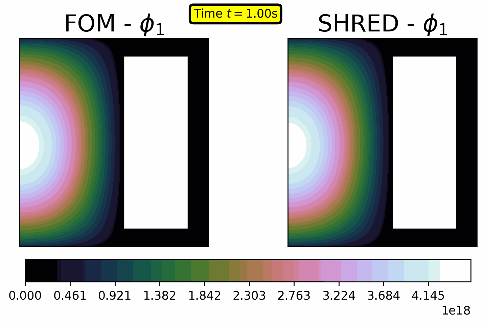
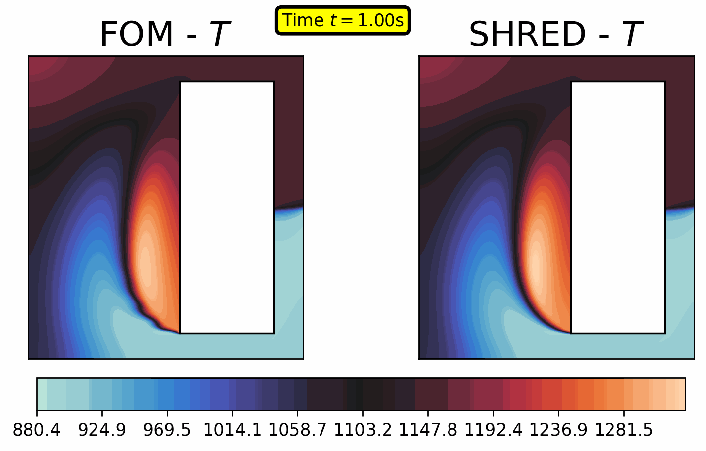

# Shallow Recurrent Decoder for Nuclear Reactors Applications (NuSHRED)

This repository collects the codes regarding the application of the **Shallow REcurrent Decoder** (SHRED) method to **Nuclear Reactors** systems 🏭⚛️

---

## 📄 Related Publications

This repository serves as complementary code to the following papers:

- **[P1]** Riva, S., Introini, C., Cammi, A., & Kutz, J. N. (2024). Robust State Estimation from Partial Out-Core Measurements with Shallow Recurrent Decoder for Nuclear Reactors. *arXiv [Physics.Ins-Det]*.
  

- **[P2]** Riva, S., Introini, C., Kutz, J. N. & Cammi, A. (2025). Towards Efficient Parametric State Estimation in Circulating Fuel Reactors with Shallow Recurrent Decoder Networks
  

- **[P3]** Introini, C., Riva, S., Kutz, J. N. & Cammi, A.(2025). From Models To Experiments: Shallow Recurrent Decoder Networks on the DYNASTY Experimental Facility
  

---

## 📊 Simulation Data
The compressed simulation datasets are available on **Zenodo**:

- **[D1]** Molten Salt Fast Reactor (MSFR) in the accidental scenario *Unprotected Loss Of Fuel Flow (ULOFF)* - Single Transient (Reconstruction mode)
- **[D2]** Molten Salt Fast Reactor (MSFR) in the accidental scenario *Unprotected Loss Of Fuel Flow (ULOFF)* - Parametric Transients
- **[D3]** DYNASTY Experimental Facility - Single Transient (Reconstruction & Prediction mode) and Parametric Transients

🎥 If you want to know more about the SHRED method for nuclear reactors, check out this [**YouTube video**](https://www.youtube.com/watch?v=AUuGhojLiFk)!

---

## 🏗️ Foundations of SHRED

The SHRED method was first proposed and developed in this paper:

- **J. Williams, O. Zahn and J. N. Kutz**, *Sensing with shallow recurrent decoder networks*, arXiv (2023) [arXiv:2301.12011]

📌 The original code base is available here: [**github.com/Jan-Williams/pyshred**](https://github.com/Jan-Williams/pyshred)

This repository also builds upon a related implementation:

- **Matteo Tomasetto, Jan P. Williams, Francesco Braghin, Andrea Manzoni, J. Nathan Kutz**, *Reduced Order Modeling with Shallow Recurrent Decoder Networks*, arXiv (2025) [arXiv:2502.10930]

📌 Improvements for Parametric datasets are available here: [**github.com/MatteoTomasetto/SHRED-ROM**](https://github.com/MatteoTomasetto/SHRED-ROM)

Additionally, the [*pyforce* package](https://github.com/ERMETE-Lab/ROSE-pyforce) is used for **sensor placements** and **EIM/GEIM comparison** in P1. See:
- [Riva et al. (2024)](https://doi.org/10.1016/j.apm.2024.06.040)
- [Cammi et al. (2024)](https://doi.org/10.1016/j.nucengdes.2024.113105)

---

## 📂 Repository Structure

📁 **shred/** → Modules for the implementation of the SHRED network from [**github.com/Jan-Williams/pyshred**](https://github.com/Jan-Williams/pyshred) and [**github.com/MatteoTomasetto/SHRED-ROM**](https://github.com/MatteoTomasetto/SHRED-ROM)

📁 **Code/** → Subfolders corresponding to the applications of SHRED in nuclear reactor concepts, with datasets associated as follows:

| | MSFR-ULOFF D1 |  MSFR-ULOFF D2  | DYNASTY D3 |
|---|:---:|:---:|:---:|
| **P1** | ✅ |   |   |
| **P2** |   | ✅ |   |
| **P3** |   |   | ✅ |

## ▶️ How to Execute

1️⃣ **Clone or download** the repository.

2️⃣ **Download the datasets** and move them into the appropriate directory.

3️⃣ **Install the required dependencies:**
   - Main dependencies: *pytorch*, *numpy*, *scikit-learn*, *matplotlib*, *scipy*, *pyvista*.
   - For P1, **pyforce** is required, see [**installation instructions**](https://ermete-lab.github.io/ROSE-pyforce/installation.html#set-up-a-conda-environment-for-pyforce)

Other packages will be installed as part of the requirements.

---

## 📬 Contact Information

For inquiries, please contact:
📧 stefano.riva@polimi.it, carolina.introini@polimi.it, antonio.cammi@polimi.it, kutz@uw.edu.

For **issues** or **bugs**, refer to the **GitHub Issues** section of this repository.

---

## 📊 Results

### 📌 Paper 1

| Flux1 | T | U |
|-------|---|---|
|  |  |  |

### 📌 Paper 2

| Flux1 | T | U |
|-------|---|---|
|  |  |  |

### 📌 Paper 3

| **Parametric Verification** |  |
|-----------------------------|-------------------------------------------------------------|
| **Parametric Validation**   |    |
| **Prediction Validation**   |    |
